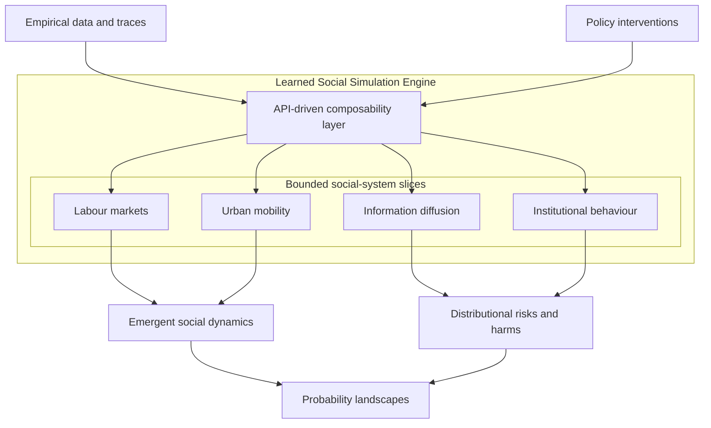

# Awesome Learned Social Simulation Engines

     

> A curated, functional map of systems that **learn, perturb, and validate** the dynamics of bounded social systems.

**Learned social simulation engines** are composable, perturbable models of complex human systems. Unlike hand-coded simulations, they learn dynamics from data, represent uncertainty as probability landscapes rather than point predictions, and support rigorous intervention testing in silico. This list curates the methods, tools, datasets, and evaluation practices for building and understanding them — each entry annotated by what it contributes to an engine, not by topic alone.

**Who this is for**

- Computational social scientists and agent-based / multi-agent modellers
- AI engineers building agent societies and synthetic populations
- Policy and intervention modellers
- Research agents needing a curated, machine-readable substrate

**How to use this list**

- Browse by **section** in the [Resource Map](#resource-map), grouped into tiers from foundations and methods to validation, risk, and data.
- Read across by **function** in the [Functional lens](#functional-lens) — reconstruct, simulate, plan, calibrate, validate, risk.
- Every entry carries a `type` label and a one-line statement of its contribution.

**What belongs**

- Primary research, maintained tools, canonical datasets, and benchmarks that advance the learned simulation of social systems.

**What does not**

- Generic AI/ML material with no social-simulation contribution, promotional pages, or unmaintained tools.

### The engine vision

Rather than a single monolithic simulator, the field is moving toward a modular landscape of tool models, each representing a bounded slice of social complexity — labour markets, urban mobility, information diffusion, institutional behaviour — composed through a shared interface and read out as probability landscapes rather than point forecasts.

## Resource Map

Sections are grouped into tiers and appear below in this order. **Function** tags each section with its main role in the [Functional lens](#functional-lens).

**Foundations**

| Section | What it contributes to the engine | Function |
|---|---|---|
| [Computational Social Science](#computational-social-science) | Field foundations, methods, and policy-relevant applications | — |
| [Complex Systems](#complex-systems) | Emergence, feedback loops, non-linearity, and adaptation | — |

**Methods**

| Section | What it contributes to the engine | Function |
|---|---|---|
| [Microsimulation](#microsimulation) | Population-level policy modelling and distributional analysis | simulate |
| [Agent-Based Modelling](#agent-based-modelling) | Micro-level behavioural simulation: frameworks, classic models, and texts | simulate |
| [Synthetic Populations](#synthetic-populations) | Population construction, digital twins, and LLM-as-population methods | reconstruct |
| [Multi-Agent Reinforcement Learning](#multi-agent-reinforcement-learning) | Strategic interaction, cooperation, competition, and adaptation | simulate · plan |
| [LLM-Based Social Simulation](#llm-based-social-simulation) | Generative agents, LLM societies, agent memory and reflection, and language-mediated behaviour | simulate |
| [Machine-Learned World Models](#machine-learned-world-models) | Learned simulation dynamics, latent environment models, and neural processes | simulate |

**Engines, systems & composability**

| Section | What it contributes to the engine | Function |
|---|---|---|
| [Existing Systems](#existing-systems) | End-to-end simulation platforms, each tagged by function | per system |
| [Bounded Slices and Composability](#bounded-slices-and-composability) | Modular system slices and patterns for coupling them | simulate |
| [Implementation Patterns](#implementation-patterns) | Engineering blueprints for differentiable ABMs and intervention-consistent surrogates | calibrate |

**Reasoning & intervention**

| Section | What it contributes to the engine | Function |
|---|---|---|
| [Causal Inference](#causal-inference) | Intervention reasoning, counterfactual logic, and causal estimation tools | plan |
| [Policy and Intervention Modelling](#policy-and-intervention-modelling) | Searching interventions and mechanisms over simulators | plan |

**Calibration, validation & benchmarks**

| Section | What it contributes to the engine | Function |
|---|---|---|
| [Uncertainty Quantification](#uncertainty-quantification) | Calibration: simulation-based inference, emulation, history matching, and sensitivity analysis | calibrate |
| [Evaluation and Validation](#evaluation-and-validation) | Checks that a calibration, simulator, or agent population can be trusted | validate |
| [Benchmarks and Testbeds](#benchmarks-and-testbeds) | Evaluation environments for agent behaviour and social dynamics | validate |
| [Standards and Reproducibility](#standards-and-reproducibility) | Model description protocols and reproducible simulation | validate |

**Risk & responsibility**

| Section | What it contributes to the engine | Function |
|---|---|---|
| [Ethical Risk Discovery](#ethical-risk-discovery) | Distributional harms, deception and misuse, privacy leakage, and governance frameworks | risk |

**Substrate & tooling**

| Section | What it contributes to the engine | Function |
|---|---|---|
| [Datasets and Empirical Grounding](#datasets-and-empirical-grounding) | Surveys, panels, and census microdata for grounding and calibration | reconstruct · validate |
| [Tools and Libraries](#tools-and-libraries) | Cross-cutting libraries for inference, diagnostics, sensitivity, networks, and geospatial data | calibrate |

**Parallels & documentation**

| Section | What it contributes to the engine | Function |
|---|---|---|
| [Frontier Science Parallels](#frontier-science-parallels) | Methodological transfers from biological, physical, and chemical simulation | — |
| [Documentation & Field Guide](./docs/) | Field-guide notes: landscape map, core concepts, and system archetypes | — |

**Entry types:** `paper` peer-reviewed paper or preprint · `book` · `article` essay, report, or news feature · `tool` library, framework, or platform · `framework` standard, protocol, or reference framework · `dataset` · `chapter` book chapter.

## Functional lens

The sections are the primary taxonomy. This functional lens is a secondary, cross-cutting view: it groups systems by what they *do* inside an engine, adapting the renderer / simulator / planner distinction from world-model research to social systems.

- **Reconstruct** — produce or reconstruct observable social state: synthetic populations, digital twins, generative agents as a population substrate.
- **Simulate** — model transitions, interactions, and counterfactuals: agent-based models, microsimulation, multi-agent reinforcement learning, learned world models, neural surrogates.
- **Plan** — use simulated futures to choose actions: reinforcement learning over simulators, policy and mechanism design, causal intervention layers.

Social systems lack the invariant laws of physical world models, so three further cross-cutting categories are first-class rather than optional:

- **Calibrate** — fit a simulator to data and quantify its uncertainty: simulation-based inference, emulation, history matching, sensitivity analysis.
- **Validate** — establish trust: calibration diagnostics, behavioural-fidelity tests and benchmarks, model documentation.
- **Risk** — surface second-order and distributional harms, and leakage from synthetic populations.

The lens is applied per section in the Resource Map's **Function** column and per system in [Existing Systems](#existing-systems).

## Resources

### Computational Social Science

- [Lazer et al. — Computational Social Science: Obstacles and Opportunities (2020)](https://www.science.org/doi/10.1126/science.aaz8170) `paper` — A decade-on state-of-the-field assessment; identifies what large-scale simulation, observational data, and experimental design can now achieve and what structural barriers remain for policy-relevant CSS.
- [Gonzalez-Bailon et al. — Computational Social Science and Sociology (2020)](https://www.annualreviews.org/content/journals/10.1146/annurev-soc-121919-054621) `paper` — Maps how computational methods, including simulation, are reshaping sociology; an orientation to the field for researchers building social engines.
- [Bail, C. — Breaking the Social Media Prism (2021)](https://press.princeton.edu/books/hardcover/9780691203423/breaking-the-social-media-prism) `book` — Uses large-scale social simulation experiments to test theories of political polarisation; a worked example of CSS methods applied to a real policy-relevant question.

### Complex Systems

- [Mitchell, M. — Complexity: A Guided Tour (2009)](https://academic.oup.com/book/51004) `book` — Single-volume primer on emergence, feedback loops, adaptation, and self-organisation; the conceptual basis for why social simulation engines behave as they do.
- [Aeon — Complex systems science allows us to see new paths forward (2024)](https://aeon.co/essays/complex-systems-science-allows-us-to-see-new-paths-forward) `article` — Connects complex systems thinking to contemporary social challenges including pandemics and inequality; explains why non-linearity and emergence make single-point predictions insufficient.
- [Farmer & Foley — The economy needs agent-based modelling (Nature 2009)](https://www.nature.com/articles/460685a) `article` — Argues that agent-based simulation engines are the right tool for economics precisely because social systems are complex and adaptive; a direct intellectual ancestor of the simulation engine concept.

### Microsimulation

- [Katikireddi et al. — Microsimulation as a flexible tool to evaluate policies and their impact on socioeconomic inequalities in health (2023)](https://pmc.ncbi.nlm.nih.gov/articles/PMC10590730/) `paper` — Demonstrates how a microsimulation engine surfaces unequal health effects of policy interventions across income and demographic groups; a worked example of distributional analysis.
- [Sutherland & Figari — EUROMOD: The European Union tax-benefit microsimulation model (International Journal of Microsimulation 2013)](https://doi.org/10.34196/ijm.00075) `paper` — Describes a multi-country tax-benefit microsimulation model, covering its policy scope, input data, validation process, and rule-programming language.
- [Li & O'Donoghue — A survey of dynamic microsimulation models: Uses, model structure and methodology (International Journal of Microsimulation 2013)](https://doi.org/10.34196/ijm.00082) `paper` — Surveys the methodological choices behind more than 60 dynamic microsimulation models, a reference for designing how simulated individuals age and transition over time.
- [OpenFisca — Rules-as-code microsimulation engine (2011–)](https://openfisca.org/en/) `tool` — Open-source engine that encodes tax and benefit legislation as code and computes its effects on real or survey population data, for testing reforms on a population.

### Agent-Based Modelling

- [Kazil, Masad & Crooks — Utilizing Python for Agent-Based Modeling: The Mesa Framework (2020)](https://link.springer.com/chapter/10.1007/978-3-030-61255-9_30) `tool` — Python ABM framework with built-in spatial and network grids, browser-based visualisation, and integration with the scientific Python stack.
- [Foramitti — AgentPy: A package for agent-based modeling in Python (2021)](https://doi.org/10.21105/joss.03065) `tool` — Pythonic ABM framework with first-class support for sensitivity analysis, parameter exploration, and Jupyter-native experiment workflows; designed for the experimental-design discipline a simulation engine needs.
- [Wilensky — NetLogo (1999)](https://ccl.northwestern.edu/netlogo/) `tool` — Widely taught ABM environment with a low floor for prototyping and a large library of curated example models for exploring emergence.
- [Collier & Ozik — Distributed Agent-Based Simulation with Repast4Py (2022)](https://pmc.ncbi.nlm.nih.gov/articles/PMC9912342/) `tool` — MPI-distributed Python ABM toolkit for running models that do not fit on one machine without leaving Python.
- [Richmond et al. — FLAME GPU 2 (2023)](https://onlinelibrary.wiley.com/doi/full/10.1002/spe.3207) `tool` — Framework for GPU-accelerated ABM at population scale, bringing million-agent simulations within reach of commodity GPUs.
- [Datseris, Vahdati & DuBois — Agents.jl: a performant and feature-full agent-based modeling software (2022)](https://journals.sagepub.com/doi/10.1177/00375497211068820) `tool` — Julia ABM framework that benchmarks faster and lower-code than mainstream alternatives, for when simulation performance is the constraint.
- [Epstein — Generative Social Science: Studies in Agent-Based Computational Modeling (2006)](https://press.princeton.edu/books/ebook/9781400842872/generative-social-science-0) `book` — Argues for ABM as theory-building ("if you didn't grow it, you didn't explain it"), the commitment that separates generative simulation from predictive modelling.
- [Railsback & Grimm — Agent-Based and Individual-Based Modeling: A Practical Introduction, 2nd ed. (2019)](https://press.princeton.edu/books/hardcover/9780691190822/agent-based-and-individual-based-modeling) `book` — Textbook covering ABM design, programming, documentation, and analysis as one workflow.
- [Schelling — Dynamic Models of Segregation (1971)](https://www.tandfonline.com/doi/abs/10.1080/0022250X.1971.9989794) `paper` — Shows simple individual rules generating large-scale segregation that no agent intends; a worked example of why aggregate outcomes need bottom-up explanation.
- [Epstein & Axtell — Growing Artificial Societies: Social Science from the Bottom Up (1996)](https://mitpress.mit.edu/9780262550253/growing-artificial-societies/) `book` — The Sugarscape monograph, in which trade, wealth distributions, group conflict, and cultural transmission emerge from minimal local rules.
- [Chopra et al. — On the Limits of Agency in Agent-Based Models (AAMAS 2025)](https://arxiv.org/abs/2409.10568) `paper` — Introduces LLM-driven behaviour archetypes inside a differentiable ABM (AgentTorch), scaling LLM-guided agent simulation to millions of agents.
- [Zheng et al. — The AI Economist: Taxation policy design via two-level deep multiagent reinforcement learning (2022)](https://www.science.org/doi/10.1126/sciadv.abk2607) `paper` — Two-level reinforcement learning framework in which economic agents and a social planner co-adapt; a worked example of MARL-based tax policy design.
- [Taillandier et al. — Building, composing and experimenting complex spatial models with the GAMA platform (GeoInformatica 2019)](https://doi.org/10.1007/s10707-018-00339-6) `tool` — Agent-based modelling platform for spatially explicit socio-environmental models, with support for composing models and running experiments on them.

> Cross-references: [Grimm et al. 2020 ODD Protocol](https://www.jasss.org/23/2/7.html) is listed under [`### Standards and Reproducibility`](#standards-and-reproducibility). They are deliberately not duplicated here.

### Synthetic Populations

- [Borysov, Rich & Pereira — How to generate micro-agents? A deep generative modeling approach to population synthesis (2019)](https://www.sciencedirect.com/science/article/abs/pii/S0968090X1831180X) `paper` — Uses variational autoencoders for population synthesis, showing how deep generative models recover sampling-zero attribute combinations that IPF/IPU methods miss.
- [Garrido, Borysov, Pereira & Rich — Composite Travel Generative Adversarial Networks for Tabular and Sequential Population Synthesis (2020)](https://arxiv.org/abs/2004.06838) `paper` — Extends population synthesis to GANs that jointly generate tabular agent attributes and sequential mobility traces, producing structurally consistent micro-agents.
- [Tang, Lu & Feng — Generating Feasible and Diverse Synthetic Populations Using Diffusion Models (2025)](https://arxiv.org/abs/2508.09164) `paper` — Diffusion-based population synthesis that improves the feasibility–diversity trade-off over VAE and GAN approaches.
- [Cao, Liu, Arora, Augenstein, Röttger & Hershcovich — Specializing Large Language Models to Simulate Survey Response Distributions for Global Populations (NAACL 2025)](https://arxiv.org/abs/2502.07068) `paper` — Fine-tunes LLMs to match survey response distributions across global populations, treating LLM-as-population as a calibration target rather than a prompt.
- [Aher, Arriaga & Kalai — Using Large Language Models to Simulate Multiple Humans and Replicate Human Subject Studies (ICML 2023)](https://arxiv.org/abs/2208.10264) `paper` — Introduces "Turing Experiments", in which an LLM simulates a sample of participants in classic behavioural studies; a precursor to LLM-as-population research.
- [Horton, Filippas & Manning — Large Language Models as Simulated Economic Agents: What Can We Learn from Homo Silicus? (NBER 2023)](https://www.nber.org/papers/w31122) `paper` — Argues that LLMs are implicit computational models of humans ("Homo silicus") that economists can endow, prompt, and interrogate as simulated agents.
- [Törnberg, Valeeva, Uitermark & Bail — Simulating Social Media Using Large Language Models to Evaluate Alternative News Feed Algorithms (2023)](https://arxiv.org/abs/2310.05984) `paper` — Builds an LLM persona population from American National Election Studies microdata to compare news-feed algorithms; a worked example of anchoring synthetic societies in survey data.
- [Tencent AI Lab — Scaling Synthetic Data Creation with 1,000,000,000 Personas (2024)](https://arxiv.org/abs/2406.20094) `paper` — Persona-driven data synthesis at billion-persona scale, showing how LLM-derived personas can serve as a population substrate.
- [Park et al. — Generative Agent Simulations of 1,000 People (2024)](https://arxiv.org/abs/2411.10109) `paper` — Builds generative agents from two-hour interviews with 1,000 US participants; the agents replicate participants' General Social Survey responses at 85% of test–retest reliability.
- [Toubia, Gui, Peng, Merlau, Li & Chen — Twin-2K-500: A Data Set for Building Digital Twins of over 2,000 People Based on Their Answers to over 500 Questions (Marketing Science 2025)](https://pubsonline.informs.org/doi/10.1287/mksc.2025.0262) `dataset` — Dataset of 2,058 US participants' answers to 500+ demographic, psychological, economic, and behavioural-experiment questions, for training and evaluating individual digital twins.
- [Bilal et al. — CitySEIRCast: An Agent-Based City Digital Twin for Pandemic Analysis and Simulation (Complex & Intelligent Systems 2024)](https://link.springer.com/article/10.1007/s40747-024-01683-x) `paper` — Builds a city-scale digital twin coupling a synthetic urban population with mobility, social-media, and contact data for epidemic analysis.
- [Kashiyama, Pang, Sekimoto & Yabe — Pseudo-PFLOW: Nationwide Synthetic Human Mobility Dataset Construction from Limited Travel Surveys and Open Data (Computer-Aided Civil and Infrastructure Engineering 2024)](https://onlinelibrary.wiley.com/doi/10.1111/mice.13285) `paper` — Constructs a synthetic mobility population covering all ~130 million people in Japan from limited travel surveys and open data; a country-scale build outside the US and Europe.
- [Lovelace et al. — A Large-Scale Geographically Explicit Synthetic Population with Social Networks for the United States (2024)](https://www.nature.com/articles/s41597-024-03970-1) `paper` — Builds a country-scale synthetic population with embedded social networks for agent-based and microsimulation use.
- [Wang et al. — Population Synthesis with Deep Generative Model: A Joint Household-Individual Approach (Computational Urban Science 2025)](https://link.springer.com/article/10.1007/s43762-025-00195-9) `paper` — Joint household-and-individual deep generative framework that handles structural zeros individual-level synthesis cannot, for downstream agent-based and microsimulation use.

> Cross-references: [Argyle et al. 2023](https://doi.org/10.1017/pan.2023.2) LLM-as-sample work is under [`### Existing Systems`](#existing-systems); [Park et al. 2023 Generative Agents](https://dl.acm.org/doi/fullHtml/10.1145/3586183.3606763) is under [`### LLM-Based Social Simulation`](#llm-based-social-simulation); [Chopra et al. 2025 AgentTorch](https://arxiv.org/abs/2409.10568) is under [`### Agent-Based Modelling`](#agent-based-modelling). They are deliberately not duplicated here.

### Multi-Agent Reinforcement Learning

- [Terry et al. — PettingZoo: Gym for Multi-Agent Reinforcement Learning (NeurIPS 2021)](https://arxiv.org/abs/2009.14471) `tool` — Gym-style API standardising how multi-agent environments expose observations, actions, rewards, and turn order; the interface most tools in this section integrate with.
- [Lanctot et al. — OpenSpiel: A Framework for Reinforcement Learning in Games (DeepMind 2019)](https://arxiv.org/abs/1908.09453) `tool` — Framework of cooperative, competitive, perfect- and imperfect-information games with game-theoretic algorithms and deep-RL training, for questions spanning normal-form, extensive-form, and repeated games.
- [Suarez, Du, Isola & Mordatch — Neural MMO: A Massively Multiagent Game Environment for Training and Evaluating Intelligent Agents (2019)](https://arxiv.org/abs/1903.00784) `tool` — Massively multi-agent persistent-world environment, inspired by MMORPGs, for studying emergent specialisation, division of labour, and population-scale dynamics.
- [Liang et al. — RLlib: Abstractions for Distributed Reinforcement Learning (ICML 2018)](https://arxiv.org/abs/1712.09381) `tool` — Distributed RL library with multi-agent abstractions and PettingZoo compatibility, for MARL experiments that outgrow a single machine.
- [Leibo, Zambaldi, Lanctot, Marecki & Graepel — Multi-agent Reinforcement Learning in Sequential Social Dilemmas (AAMAS 2017)](https://arxiv.org/abs/1702.03037) `paper` — Introduces sequential social dilemmas, Markov games in which collective rationality conflicts with individual learning, for studying cooperation, defection, and free-riding.
- [Carroll, Shah, Ho, Griffiths, Seshia, Abbeel & Dragan — On the Utility of Learning about Humans for Human-AI Coordination (NeurIPS 2019)](https://arxiv.org/abs/1910.05789) `paper` — Uses an Overcooked-based environment to show that RL agents trained by self-play coordinate poorly with humans, motivating human-aware coordination methods.
- [Lowe, Wu, Tamar, Harb, Abbeel & Mordatch — Multi-Agent Actor-Critic for Mixed Cooperative-Competitive Environments (MADDPG, NeurIPS 2017)](https://arxiv.org/abs/1706.02275) `paper` — Centralised-critic actor-critic method (MADDPG) for mixed cooperative-competitive settings, introducing centralised training with decentralised execution.
- [Rashid, Samvelyan, Schroeder de Witt, Farquhar, Foerster & Whiteson — QMIX: Monotonic Value Function Factorisation for Deep Multi-Agent Reinforcement Learning (ICML 2018)](https://arxiv.org/abs/1803.11485) `paper` — Value-decomposition method (QMIX) that factorises a joint Q-function as a monotonic mixture of per-agent Q-functions for cooperative MARL under partial observability.
- [Foerster, Farquhar, Afouras, Nardelli & Whiteson — Counterfactual Multi-Agent Policy Gradients (COMA, AAAI 2018)](https://arxiv.org/abs/1705.08926) `paper` — Counterfactual baseline (COMA) that marginalises out one agent's action to isolate its contribution to the team reward, addressing credit assignment in cooperative MARL.
- [Yu, Velu, Vinitsky, Gao, Wang & Bayen — The Surprising Effectiveness of PPO in Cooperative Multi-Agent Games (MAPPO, NeurIPS 2022 D&B)](https://arxiv.org/abs/2103.01955) `paper` — Shows that PPO with shared parameters and centralised value functions (MAPPO) matches or beats specialised cooperative MARL methods on standard benchmarks.
- [Meta FAIR Diplomacy Team — Human-level play in the game of Diplomacy by combining language models with strategic reasoning (CICERO, Science 2022)](https://www.science.org/doi/10.1126/science.ade9097) `paper` — Reaches human-level Diplomacy play by combining a dialogue language model with a strategic reasoning module, showing LLM–MARL hybrids coordinating through natural language.
- [Strouse, McKee, Botvinick, Hughes & Everett — Collaborating with Humans without Human Data (Fictitious Co-Play, NeurIPS 2021)](https://arxiv.org/abs/2110.08176) `paper` — Fictitious co-play trains an agent against a population of self-play partners so it can coordinate with novel human partners zero-shot.

> Cross-references: [Vezhnevets et al. 2023 Concordia](https://arxiv.org/abs/2312.03664) and [Altera.AL 2024 Project Sid](https://arxiv.org/abs/2411.00114) are listed under [`### Existing Systems`](#existing-systems); [Park et al. 2023 Generative Agents](https://dl.acm.org/doi/fullHtml/10.1145/3586183.3606763) is under [`### LLM-Based Social Simulation`](#llm-based-social-simulation); [Chopra et al. 2025 AgentTorch](https://arxiv.org/abs/2409.10568) and [Zheng et al. 2022 The AI Economist](https://www.science.org/doi/10.1126/sciadv.abk2607) are under [`### Agent-Based Modelling`](#agent-based-modelling); [Agapiou et al. 2023 Melting Pot 2.0](https://arxiv.org/abs/2211.13746) is under [`### Benchmarks and Testbeds`](#benchmarks-and-testbeds). They touch MARL but are deliberately not duplicated here.

### LLM-Based Social Simulation

- [Bougie, Ye & Watanabe — CityReal: Human-Aligned Urban Behavior and City Dynamics Simulation with Large-Scale LLM Agents (2026)](https://arxiv.org/abs/2608.16897) `paper` — Large-scale human-aligned urban simulation where intention-driven LLM agents learn habits and preferences via textual adapters to match real population statistics at micro and macro scale.
- [Park, Popowski, Cai, Morris, Liang & Bernstein — Social Simulacra: Creating Populated Prototypes for Social Computing Systems (UIST 2022)](https://arxiv.org/abs/2208.04024) `paper` — Uses GPT-3 to populate a Reddit-style community for design prototyping, showing an LLM can simulate a plausible online community; a predecessor to Generative Agents.
- [Park et al. — Generative Agents: Interactive Simulacra of Human Behavior (2023)](https://dl.acm.org/doi/fullHtml/10.1145/3586183.3606763) `paper` — Demonstrates LLM-driven agents that wake up, form relationships, and coordinate events in a simulated town; a working example of a generative social simulation engine.
- [Packer, Wooders, Lin, Fang, Patil, Stoica & Gonzalez — MemGPT: Towards LLMs as Operating Systems (2023)](https://arxiv.org/abs/2310.08560) `paper` — Virtual-context architecture that pages information in and out of an LLM's context window with OS-style memory tiers, giving long-running agents persistent memory.
- [Wang, Xie, Jiang, Mandlekar, Xiao, Zhu, Fan & Anandkumar — Voyager: An Open-Ended Embodied Agent with Large Language Models (NeurIPS 2023)](https://arxiv.org/abs/2305.16291) `paper` — Lifelong LLM agent with an automatic curriculum, a growing skill library, and iterative self-verification; an architecture for open-ended autonomous behaviour.
- [Shinn, Cassano, Berman, Gopinath, Narasimhan & Yao — Reflexion: Language Agents with Verbal Reinforcement Learning (NeurIPS 2023)](https://arxiv.org/abs/2303.11366) `paper` — Uses verbal self-reflection on prior trajectories as a learning signal in place of weight updates; the reflection mechanism reused in generative-agent architectures.
- [Li, Hammoud, Itani, Khizbullin & Ghanem — CAMEL: Communicative Agents for "Mind" Exploration of Large Language Model Society (NeurIPS 2023)](https://arxiv.org/abs/2303.17760) `tool` — Role-playing framework that pairs LLM agents under "inception prompting" so they cooperate on a task with minimal human instruction, for studying agent cooperation.
- [Chen, Su, Zuo, Yang, Yuan, Qian, Chan, Qin, Lu, Xie, Liu, Sun & Zhou — AgentVerse: Facilitating Multi-Agent Collaboration and Exploring Emergent Behaviors (ICLR 2024)](https://arxiv.org/abs/2308.10848) `tool` — Multi-agent framework built to study how groups of LLM agents develop emergent behaviours during collaborative tasks.
- [Liu, Yang, Jia, Zhang, Yang & Vosoughi — Training Socially Aligned Language Models on Simulated Social Interactions (Stable Alignment, ICLR 2024)](https://arxiv.org/abs/2305.16960) `paper` — Trains an LLM inside a sandboxed society of LLM agents that give each other social feedback, aligning it through simulated interaction rather than direct human ratings.
- [Santurkar, Durmus, Ladhak, Lee, Liang & Hashimoto — Whose Opinions Do Language Models Reflect? (ICML 2023)](https://arxiv.org/abs/2303.17548) `paper` — Measures how LLM opinions on US policy issues align with different demographic groups, showing the population skew that LLM-as-population simulations inherit.
- [Chuang, Goyal, Harlalka, Suresh, Hawkins, Yang, Shah, Hu & Rogers — Simulating Opinion Dynamics with Networks of LLM-based Agents (NAACL 2024 Findings)](https://arxiv.org/abs/2311.09618) `paper` — Runs classic opinion-dynamics models with LLM agents on network topologies, testing whether LLM populations reproduce polarisation and consensus formation.
- [CoevolveSim — Belief Coevolution in a Social Network of Generalist and Specialist Large Language Models (2026)](https://arxiv.org/abs/2607.27512) `paper` — Introduces a networked LLM simulation for studying how beliefs coevolve when generalist and specialist agents interact.
- [Salvi, Horta Ribeiro, Gallotti & West — On the Conversational Persuasiveness of Large Language Models: A Randomized Controlled Trial (Nature Human Behaviour 2024)](https://arxiv.org/abs/2403.14380) `paper` — Pre-registered RCT finding that GPT-4 with light personalisation out-persuades humans in debates; a template for measuring persuasion effects in simulated societies.
- [Nature — The first 'AI societies' are taking shape (2026)](https://www.nature.com/articles/d41586-026-00070-5) `article` — A Nature news feature surveying the emerging landscape of AI-powered social simulation engines and the scientific and ethical questions they raise.

> Cross-references: [Vezhnevets et al. 2023 Concordia](https://arxiv.org/abs/2312.03664), [Altera.AL 2024 Project Sid](https://arxiv.org/abs/2411.00114), [Yang et al. 2024 OASIS](https://arxiv.org/abs/2411.11581), [Gao et al. 2025 AgentSociety](https://arxiv.org/abs/2502.08691) and [Argyle et al. 2023 Out of One, Many](https://doi.org/10.1017/pan.2023.2) are listed under [`### Existing Systems`](#existing-systems); [Park et al. 2024 Generative Agent Simulations of 1,000 People](https://arxiv.org/abs/2411.10109), [Aher et al. 2023 Turing Experiments](https://arxiv.org/abs/2208.10264), [Horton et al. 2023 Homo Silicus](https://www.nber.org/papers/w31122), [Törnberg et al. 2023](https://arxiv.org/abs/2310.05984), [Toubia et al. 2025 Twin-2K-500](https://pubsonline.informs.org/doi/10.1287/mksc.2025.0262), [Tencent 2024 1B Personas](https://arxiv.org/abs/2406.20094) and [Cao et al. 2025](https://arxiv.org/abs/2502.07068) are under [`### Synthetic Populations`](#synthetic-populations); [Meta FAIR 2022 CICERO](https://www.science.org/doi/10.1126/science.ade9097) is under [`### Multi-Agent Reinforcement Learning`](#multi-agent-reinforcement-learning); [Chopra et al. 2025 AgentTorch](https://arxiv.org/abs/2409.10568) and [Zheng et al. 2022 The AI Economist](https://www.science.org/doi/10.1126/sciadv.abk2607) are under [`### Agent-Based Modelling`](#agent-based-modelling); [Kıcıman et al. 2023](https://arxiv.org/abs/2305.00050) and [Nilforoshan et al. 2024](https://arxiv.org/abs/2404.11794) are under [`### Causal Inference`](#causal-inference); [Mei et al. 2024 Turing test](https://www.pnas.org/doi/10.1073/pnas.2313925121) is under [`### Evaluation and Validation`](#evaluation-and-validation). They are deliberately not duplicated here.

### Machine-Learned World Models

- [Ha & Schmidhuber — World Models (NeurIPS 2018)](https://arxiv.org/abs/1803.10122) `paper` — Introduces learned latent-dynamics world models trained from pixels and optimises a policy inside them, framing "learn the simulator" as a research direction.
- [Hafner, Lillicrap, Fischer, Villegas, Ha, Lee & Davidson — Learning Latent Dynamics for Planning from Pixels (PlaNet, ICML 2019)](https://arxiv.org/abs/1811.04551) `paper` — Introduces the Recurrent State-Space Model (RSSM), which learns a stochastic latent transition model from images and plans inside it.
- [Hafner, Pasukonis, Ba & Lillicrap — Mastering diverse control tasks through world models (DreamerV3, Nature 2025)](https://www.nature.com/articles/s41586-025-08744-2) `paper` — General world-model agent that masters 150+ tasks with one set of hyperparameters by training its policy inside a learned latent-dynamics simulator.
- [Schrittwieser, Antonoglou, Hubert, Simonyan, Sifre, Schmitt, Guez, Lockhart, Hassabis, Graepel, Lillicrap & Silver — Mastering Atari, Go, Chess and Shogi by Planning with a Learned Model (MuZero, Nature 2020)](https://www.nature.com/articles/s41586-020-03051-4) `paper` — Plans inside a learned environment model without being given the rules, showing that domains without a simulator can be controlled through a learned one.
- [Bruce, Dennis, Edwards, Parker-Holder, Shi, Hughes, Lai, Mavalankar, Steigerwald, Apps, Aytar, Bechtle, Behbahani, Chan, Heess, Gonzalez, Osindero, Ozair, Reed, Zhang, Zolna, Clune, de Freitas, Singh & Rocktäschel — Genie: Generative Interactive Environments (ICML 2024)](https://arxiv.org/abs/2402.15391) `paper` — Foundation model trained on internet video that generates playable interactive environments from a single image, showing learned simulators can be conditioned as well as sampled.
- [Hu, Russell, Yeo, Murez, Fedoseev, Kendall, Shotton & Corrado — GAIA-1: A Generative World Model for Autonomous Driving (2023)](https://arxiv.org/abs/2309.17080) `paper` — Multi-modal generative world model for driving conditioned on text, image, and action; a steerable generative environment for a real social-physical domain.
- [Valevski, Leviathan, Arar & Fruchter — Diffusion Models Are Real-Time Game Engines (GameNGen, 2024)](https://arxiv.org/abs/2408.14837) `paper` — Diffusion model that simulates DOOM at interactive frame rates from player input, showing a neural network alone can act as a real-time simulator.
- [Gao et al. — Infinite Worlds with Versatile Interactions (LingBot-World 2.0, 2026)](https://github.com/robbyant/lingbot-world-v2) `tool` — Provides an open-source real-time world-model substrate with long-horizon interactive video generation, multi-user control, and director–pilot agents for coordinating characters and scene evolution.
- [Garnelo, Rosenbaum, Maddison, Ramalho, Saxton, Shanahan, Teh, Rezende & Eslami — Conditional Neural Processes (ICML 2018)](https://arxiv.org/abs/1807.01613) `paper` — Introduces conditional neural processes, which map a context set of observations to a distribution over functions in one forward pass, an amortised callable simulator primitive.
- [Garnelo, Schwarz, Rosenbaum, Viola, Rezende, Eslami & Teh — Neural Processes (ICML 2018 workshop)](https://arxiv.org/abs/1807.01622) `paper` — Latent-variable extension of conditional neural processes that defines the neural process family and adds predictive uncertainty.
- [Kim, Mnih, Schwarz, Garnelo, Eslami, Rosenbaum, Vinyals & Teh — Attentive Neural Processes (ICLR 2019)](https://arxiv.org/abs/1901.05761) `paper` — Adds cross-attention from targets to context in neural processes, fixing the under-fitting of vanilla NPs so the model tracks observed data.
- [Coletta, Moulin, Vyetrenko & Balch — Learning to Simulate Realistic Limit Order Book Markets From Data as a World Agent (ICAIF 2022)](https://arxiv.org/abs/2210.09897) `paper` — Learns a limit order book market simulator from data by treating the whole exchange as a single neural "world agent" that reacts to order flow.
- [Suo, Regalado, Casas & Urtasun — TrafficSim: Learning to Simulate Realistic Multi-Agent Behaviors (CVPR 2021)](https://arxiv.org/abs/2101.06557) `paper` — Neural multi-agent traffic simulator trained on real driving logs that learns reactive, socially plausible behaviour for all road users in a scene.

> Cross-references: [Cranmer, Brehmer & Louppe 2020 The Frontier of Simulation-Based Inference](https://www.pnas.org/doi/10.1073/pnas.1912789117), [Tejero-Cantero et al. 2020 sbi toolkit](https://joss.theoj.org/papers/10.21105/joss.02505), [Lueckmann et al. 2021 Benchmarking SBI](https://arxiv.org/abs/2101.04653), [Dyer et al. 2022 Black-box Bayesian inference for economic ABMs](https://arxiv.org/abs/2202.00625) are listed under [`### Uncertainty Quantification`](#uncertainty-quantification); [Hermans et al. 2022 A Trust Crisis in Simulation-Based Inference?](https://arxiv.org/abs/2110.06581) and [Talts et al. 2018 Simulation-Based Calibration](https://arxiv.org/abs/1804.06788) are under [`### Evaluation and Validation`](#evaluation-and-validation); [Wang et al. 2023 Voyager](https://arxiv.org/abs/2305.16291) is under [`### LLM-Based Social Simulation`](#llm-based-social-simulation); [Meta FAIR 2022 CICERO](https://www.science.org/doi/10.1126/science.ade9097) is under [`### Multi-Agent Reinforcement Learning`](#multi-agent-reinforcement-learning); [Zheng et al. 2022 The AI Economist](https://www.science.org/doi/10.1126/sciadv.abk2607) is under [`### Agent-Based Modelling`](#agent-based-modelling). They are deliberately not duplicated here.

### Existing Systems

_Functional lens — primary role of each system (see [Functional lens](#functional-lens)):_

| System | Function |
|---|---|
| Concordia | simulate |
| Project Sid | simulate · plan |
| OASIS | simulate |
| AgentSociety | simulate |
| Out of One, Many | reconstruct |

- [Vezhnevets et al. — Concordia: Generative Agent-Based Modelling with Actions Grounded in Physical, Social, or Digital Space (2023)](https://arxiv.org/abs/2312.03664) `tool` — Open-source library for building LLM-driven multi-agent simulations grounded in physical, social, or digital environments, designed for social science modelling with generative agents.
- [Altera.AL — Project Sid: Many-Agent Simulations Toward AI Civilization (2024)](https://arxiv.org/abs/2411.00114) `paper` — Simulates 10 to 1,000+ AI agents that develop specialised professions, governance structures, cultural norms, and economic systems in a shared environment.
- [Yang et al. — OASIS: Open Agent Social Interaction Simulations with One Million Agents (2024)](https://arxiv.org/abs/2411.11581) `tool` — Scalable social media simulator supporting up to one million LLM-driven agents with dynamic social networks, recommendation systems, and diverse action spaces; designed to study large-scale group behaviour and information propagation.
- [Gao et al. — AgentSociety: Large-Scale Simulation of LLM-Driven Generative Agents (2025)](https://arxiv.org/abs/2502.08691) `paper` — Proposes a large-scale social simulator with a dedicated simulation engine, a realistic societal environment, and 10,000+ LLM-driven agents.
- [Argyle et al. — Out of One, Many: Using Language Models to Simulate Human Samples (2023)](https://doi.org/10.1017/pan.2023.2) `paper` — Shows that LLMs conditioned on demographic profiles can reproduce the distribution of human survey responses; evidence for using LLM agents as synthetic populations.

### Bounded Slices and Composability

- [Pogonyi — Transport Modeling (2020)](https://www.sciencedirect.com/science/article/pii/S2543000920300391) `chapter` — Surveys how bounded transport models serve as tool-models for urban economic planning.
- [Mérő, Borsos, Hosszú, Oláh & Vágó — A high-resolution, data-driven agent-based model of the housing market (2023)](https://doi.org/10.1016/j.jedc.2023.104738) `paper` — A self-contained slice modelling the interaction between credit constraints and housing prices.
- [Flache et al. — Models of Social Influence: Towards the Next Generation (2017)](https://www.jasss.org/20/4/2.html) `paper` — Review of bounded models of social influence for opinion dynamics and norm formation.
- [Lorenz — Continuous Opinion Dynamics under Bounded Confidence: A Survey (2007)](https://doi.org/10.1142/S0129183107011789) `paper` — Survey of continuous opinion dynamics under bounded confidence, a core model family for the social-influence slice.
- [Althouse et al. — Enhancing disease surveillance with novel data streams: challenges and opportunities (2015)](https://doi.org/10.1140/epjds/s13688-015-0054-0) `paper` — Explores how web-search and social-media-derived behaviour slices inform epidemic surveillance and simulation engines.
- [Adam — Special report: The simulations driving the world’s response to COVID-19 (2020)](https://www.nature.com/articles/d41586-020-01003-6) `article` — Nature report on the mechanistic epidemic simulations that informed COVID-19 policy, illustrating a single bounded slice used for decisions.
- [Acemoglu & Jackson — History, Expectations, and Leadership in the Evolution of Social Norms (2011)](https://www.nber.org/papers/w17066) `paper` — Models how beliefs, expectations, and leadership stabilise or shift cooperative norms; a template for institutional behaviour beyond individual agents.
- [Golder & Macy — Digital Footprints: Opportunities and Challenges for Online Social Research (2014)](https://www.annualreviews.org/eprint/KiHmqacYVWqAJvNvpPW4/full/10.1146/annurev-soc-071913-043145) `paper` — Explores how fine-grained, time-stamped digital traces can support empirical validation of social dynamics in the digital age.
- [Cao — Research on co-simulation of multi-resolution models based on HLA (2023)](https://doi.org/10.1177/00375497221107940) `paper` — Patterns for orchestrating multiple simulation models through HLA-based federated coupling and shared simulation state.
- [Gao et al. — Large language models empowered agent-based modeling and simulation: a survey and perspectives (2024)](https://www.nature.com/articles/s41599-024-03611-3) `paper` — Surveys the "simulation-as-a-tool" pattern for LLM-driven agent-based simulation workflows.
- [Horni, Nagel & Axhausen (eds.) — The Multi-Agent Transport Simulation MATSim (2016)](https://doi.org/10.5334/baw) `book` — Open-access book on an open-source framework that simulates traffic by following individual synthetic travellers through their daily activity plans, a reusable transport slice.

### Implementation Patterns

- [Chopra et al. — flame: A Framework for Learning in Agent-based ModEls (AAMAS 2024)](https://www.media.mit.edu/publications/flame-a-framework-for-learning-in-agent-based-models-1/) `tool` — The AgentTorch implementation of differentiable ABMs in PyTorch; enables automatic differentiation through agent interactions for rapid calibration.
- [Andelfinger — Towards Differentiable Agent-Based Simulation (2022)](https://doi.org/10.1145/3565810) `paper` — Demonstrates how automatic differentiation can support gradient-based optimization and calibration in complex social ABMs.
- [Dyer et al. — Interventionally Consistent Surrogates for Complex Simulation Models (2024)](https://arxiv.org/abs/2312.11158) `paper` — Learns neural surrogates of complex simulators that remain consistent under interventions of interest, using causal abstraction.
- [Quera-Bofarull, Dyer, Calinescu, Farmer & Wooldridge — BlackBIRDS: Black-Box Inference foR Differentiable Simulators (JOSS 2023)](https://doi.org/10.21105/joss.05776) `tool` — Python package that provides a PyTorch structure for differentiable simulators and gradient-assisted procedures for estimating their parameters.

### Causal Inference

- [Hernán, M.A. & Robins, J.M. — Causal Inference: What If (2023)](https://miguelhernan.org/whatifbook/) `book` — Free textbook on causal inference with potential outcomes, covering the counterfactual reasoning and intervention analysis a simulation engine needs.
- [Kıcıman et al. — Causal Reasoning and Large Language Models: Opening a New Frontier for Causality (2023)](https://arxiv.org/abs/2305.00050) `paper` — Evaluates whether LLMs can support causal reasoning in simulation contexts; directly relevant to building intervention layers in LLM-augmented social engines.
- [Nilforoshan et al. — Language Models as Scientist and Subjects (2024)](https://arxiv.org/abs/2404.11794) `paper` — Uses structural causal models combined with LLMs to automatically generate and test social scientific hypotheses in silico; a working example of causal simulation engine methodology.
- [Imbens, G.W. & Rubin, D.B. — Causal Inference for Statistics, Social, and Biomedical Sciences: An Introduction (2015)](https://www.cambridge.org/core/books/causal-inference-for-statistics-social-and-biomedical-sciences/71126BE90C58F1A431FE9B2DD07938AB) `book` — Reference text for the Rubin potential-outcomes framework (randomised experiments, observational studies, propensity scores, instrumental variables); the companion to the SCM tradition for intervention reasoning.
- [Pearl, J. — Causality: Models, Reasoning, and Inference, 2nd ed. (2009)](https://www.cambridge.org/core/books/causality/B0046844FAE10CBF274D4ACBDAEB5F5B) `book` — Establishes structural causal models, do-calculus, and the counterfactual hierarchy as the mathematical foundation for intervention reasoning.
- [Sharma, A. & Kıcıman, E. — DoWhy: An End-to-End Library for Causal Inference (2020)](https://arxiv.org/abs/2011.04216) `tool` — Python library that unifies graphical-model and potential-outcomes workflows behind a model–identify–estimate–refute pipeline with explicit assumption testing.
- [Battocchi et al. — EconML: A Python Package for ML-Based Heterogeneous Treatment Effects Estimation (2019)](https://github.com/py-why/EconML) `tool` — Python library implementing double machine learning, doubly robust learners, causal forests, and meta-learners for heterogeneous treatment effect estimation.
- [Chen, Harinen, Lee, Yung & Zhao — CausalML: Python Package for Causal Machine Learning (2020)](https://arxiv.org/abs/2002.11631) `tool` — Python library for uplift modelling and CATE estimation via meta-learners (S/T/X/R), uplift trees, and causal forests; used for experimentation and policy targeting.
- [Ankan, A. & Textor, J. — pgmpy: A Python Toolkit for Bayesian Networks (JMLR 2024)](https://jmlr.org/papers/v25/23-0487.html) `tool` — Python toolkit for Bayesian-network structure learning, parameter estimation, inference, and DAG-based causal reasoning; complements DoWhy and EconML when the target is the causal structure itself.
- [Zheng, Aragam, Ravikumar & Xing — DAGs with NO TEARS: Continuous Optimization for Structure Learning (NeurIPS 2018)](https://arxiv.org/abs/1803.01422) `paper` — Reformulates DAG structure learning as a smooth continuous optimisation problem, the starting point of gradient-based causal discovery.
- [Xia, Lee, Bengio & Bareinboim — The Causal-Neural Connection: Expressiveness, Learnability, and Inference (NeurIPS 2021)](https://proceedings.neurips.cc/paper/2021/hash/5989add1703e4b0480f75e2390739f34-Abstract.html) `paper` — Formalises Neural Causal Models and shows that universal-approximation networks do not automatically learn the right SCM; a principled basis for combining deep learning with causal inference.

> Cross-references: [Dyer et al. 2024 Interventionally Consistent Surrogates](https://arxiv.org/abs/2312.11158) is listed under [`### Implementation Patterns`](#implementation-patterns). They are deliberately not duplicated here.

### Policy and Intervention Modelling

- [Capobianco, Kompella, Ault, Sharon, Jong, Fox, Meyers, Wurman & Stone — Agent-based Markov Modeling for Improved COVID-19 Mitigation Policies (JAIR 2021)](https://dl.acm.org/doi/10.1613/jair.1.12632) `paper` — Pairs an open-source agent-based COVID-19 simulator (PandemicSimulator) with RL that searches non-pharmaceutical interventions to balance hospital load against economic cost.
- [Chopra, Rodriguez, Prakash, Raskar & Kingsley — Using neural networks to calibrate agent based models enables improved regional evidence for vaccine strategy and policy (Vaccine 2023)](https://doi.org/10.1016/j.vaccine.2023.08.060) `paper` — Uses gradient-trained neural networks to calibrate million-agent ABMs in seconds, applying AgentTorch to regional vaccine-policy decisions.
- [Du, Chen, Yang, Long & Zhao — HRL4EC: Hierarchical Reinforcement Learning for Multi-Mode Epidemic Control (Information Sciences 2023)](https://doi.org/10.1016/j.ins.2023.119065) `paper` — Hierarchical RL over an SEIR model that jointly designs contact-restriction, vaccination, and treatment interventions for multi-lever epidemic policy.
- [Wu, Kreidieh, Parvate, Vinitsky & Bayen — Flow: A Modular Learning Framework for Mixed Autonomy Traffic (IEEE Transactions on Robotics 2022)](https://doi.org/10.1109/TRO.2021.3087314) `tool` — Deep-RL framework wrapping the SUMO traffic simulator for training and evaluating control policies in mixed human and autonomous-vehicle traffic at network scale.
- [Wei, Zheng, Yao & Li — IntelliLight: A Reinforcement Learning Approach for Intelligent Traffic Light Control (KDD 2018)](https://dl.acm.org/doi/10.1145/3219819.3220096) `paper` — Deep-RL traffic-signal controller trained and validated on real surveillance-camera traffic data; a worked example of RL-driven signal-policy design.
- [Strnad, Barfuss, Donges & Heitzig — Deep Reinforcement Learning in World-Earth System Models to Discover Sustainable Management Strategies (Chaos 2019)](https://doi.org/10.1063/1.5124673) `paper` — Deep-RL agents acting inside World–Earth system models discover sustainable management pathways, such as mixes of carbon taxes and renewable subsidies.
- [Zhang, Williams, Phade, Srinivasa, Y. Zhang, Gupta, Bengio & Zheng — AI for Global Climate Cooperation: Modeling Global Climate Negotiations, Agreements, and Long-Term Cooperation in RICE-N (ICML 2025)](https://proceedings.mlr.press/v267/zhang25ce.html) `paper` — Multi-region integrated assessment model with explicit negotiation protocols, used as a MARL environment for designing global climate-cooperation mechanisms.
- [Dütting, Feng, Narasimhan, Parkes & Ravindranath — Optimal Auctions through Deep Learning: Advances in Differentiable Economics (JACM 2024)](https://doi.org/10.1145/3630749) `paper` — Frames optimal auction design as a constrained deep-learning problem (differentiable economics), for interventions that can be cast as mechanisms.
- [Kerr et al. — Covasim: An agent-based model of COVID-19 dynamics and interventions (PLOS Computational Biology 2021)](https://doi.org/10.1371/journal.pcbi.1009149) `tool` — Open-source epidemic ABM supporting distancing, vaccination, testing, isolation, contact tracing, and quarantine interventions, for comparing policy scenarios.

### Uncertainty Quantification

- [Kahn et al. — Uncertainty Quantification for Agent-Based Models (2024)](https://arxiv.org/abs/2409.16776) `paper` — Applies Gaussian processes, sequential design, and history matching to quantify uncertainty in ABM outputs, so engines report calibrated rather than overconfident results.
- [Salter et al. — Improving Policy-Oriented Agent-Based Modeling with History Matching (2025)](https://arxiv.org/abs/2501.00616) `paper` — Demonstrates history matching as a principled method for calibrating policy-oriented ABMs against real-world data; directly applicable to validating social simulation engines.
- [Saltelli et al. — Global Sensitivity Analysis: The Primer (2008)](https://publications.jrc.ec.europa.eu/repository/handle/JRC40639) `book` — Reference text on global sensitivity analysis; explains how to identify which uncertain inputs drive the variance of a simulator's outputs.
- [Cranmer, Brehmer & Louppe — The Frontier of Simulation-Based Inference (PNAS 2020)](https://www.pnas.org/doi/10.1073/pnas.1912789117) `paper` — Review that frames neural simulation-based inference as a field, placing NPE, NLE, and NRE alongside classical ABC for simulators whose likelihood is intractable.
- [Papamakarios, Sterratt & Murray — Sequential Neural Likelihood: Fast Likelihood-free Inference with Autoregressive Flows (AISTATS 2019)](https://arxiv.org/abs/1805.07226) `paper` — Trains autoregressive-flow likelihood emulators on simulator runs, turning an opaque ABM or mechanistic simulator into a usable Bayesian model.
- [Tejero-Cantero, Boelts, Deistler, Lueckmann, Durkan, Gonçalves, Greenberg & Macke — sbi: A toolkit for simulation-based inference (JOSS 2020)](https://joss.theoj.org/papers/10.21105/joss.02505) `tool` — Python toolkit implementing NPE, NLE, NRE, and their sequential variants behind a uniform API for applying neural SBI to a real simulator.
- [Lueckmann, Boelts, Greenberg, Gonçalves & Macke — Benchmarking Simulation-Based Inference (AISTATS 2021)](https://arxiv.org/abs/2101.04653) `paper` — Benchmark of SBI algorithms (NPE, NLE, NRE, SMC-ABC) across ten simulator tasks, for choosing a calibration method by evidence rather than reputation.
- [Dyer, Cannon, Farmer & Schmon — Black-box Bayesian inference for economic agent-based models (2022)](https://arxiv.org/abs/2202.00625) `paper` — Applies neural simulation-based inference to large economic ABMs with intractable likelihoods; a template for amortised posterior calibration that complements history matching.
- [Andrianakis, Vernon, McCreesh, McKinley, Oakley, Nsubuga, Goldstein & White — Bayesian History Matching of Complex Infectious Disease Models Using Emulation (PLOS Comp Bio 2015)](https://journals.plos.org/ploscompbiol/article?id=10.1371/journal.pcbi.1003968) `paper` — Tutorial and case study fitting an HIV transmission simulator with Gaussian-process emulators and waves of implausibility cuts; the Bayesian emulation method later ABM history-matching work builds on.
- [Kasim et al. — Building high accuracy emulators for scientific simulations with deep neural architecture search (MLST 2021)](https://iopscience.iop.org/article/10.1088/2632-2153/ac3ffa) `paper` — Shows that deep-network emulators found by architecture search can replace ten scientific simulators at large speedups; a path from GP emulators to deep emulators for high-dimensional simulators.

### Evaluation and Validation

- [Talts, Betancourt, Simpson, Vehtari & Gelman — Validating Bayesian Inference Algorithms with Simulation-Based Calibration (2018)](https://arxiv.org/abs/1804.06788) `paper` — Simulation-based calibration: draw from the prior, simulate, and check rank uniformity to test whether a Bayesian inference pipeline is itself well calibrated.
- [Hermans, Delaunoy, Rozet, Wehenkel, Begy & Louppe — A Trust Crisis in Simulation-Based Inference? Your Posterior Approximations Can Be Unfaithful (TMLR 2022)](https://arxiv.org/abs/2110.06581) `paper` — Shows empirically that neural SBI posteriors can be silently overconfident, a check to run before trusting a calibrated social simulator.
- [Mei, Xie, Yuan & Jackson — A Turing test of whether AI chatbots are behaviorally similar to humans (PNAS 2024)](https://www.pnas.org/doi/10.1073/pnas.2313925121) `paper` — Compares LLMs with humans across classic economic games and Big Five personality measures, a behavioural-fidelity test for LLM agents.
- [Windrum, Fagiolo & Moneta — Empirical Validation of Agent-Based Models: Alternatives and Prospects (JASSS 2007)](https://www.jasss.org/10/2/8.html) `paper` — Reviews approaches to empirically validating agent-based models and the methodological problems each faces, for choosing a validation strategy.
- [Bisbee, Clinton, Dorff, Kenkel & Larson — Synthetic Replacements for Human Survey Data? The Perils of Large Language Models (Political Analysis 2024)](https://doi.org/10.1017/pan.2024.5) `paper` — Finds that LLM personas match average ANES thermometer scores but show too little variance and yield regression estimates that differ from real survey data.
- [Larooij & Törnberg — Do Large Language Models Solve the Problems of Agent-Based Modeling? A Critical Review of Generative Social Simulations (2025)](https://arxiv.org/abs/2504.03274) `paper` — Critical review finding that generative agent-based simulations mostly validate by subjective believability and do not yet demonstrate operational validity.
- [Wang, Morgenstern & Dickerson — Large language models that replace human participants can harmfully misportray and flatten identity groups (Nature Machine Intelligence 2025)](https://doi.org/10.1038/s42256-025-00986-z) `paper` — Shows that LLMs standing in for human participants misportray and flatten demographic groups, a validity and harm check for LLM-as-population simulation.
- [Anthis et al. — Position: LLM Social Simulations Are a Promising Research Method (ICML 2025)](https://proceedings.mlr.press/v267/anthis25a.html) `paper` — Argues that LLM simulations of research subjects can become accurate and verifiable by addressing five tractable challenges, with directions such as context-rich prompting and fine-tuning.
- [Ashokkumar, Hewitt, Ghezae & Willer — Large language models can predict the results of social science experiments (Nature 2026)](https://doi.org/10.1038/s41586-026-10742-x) `paper` — Finds that GPT-4 predictions of treatment effects across an archive of social science experiments correlate strongly with the actual effects, at accuracy similar to pooled human forecasts.

### Benchmarks and Testbeds

- [Agapiou et al. — Melting Pot 2.0 (DeepMind 2023)](https://arxiv.org/abs/2211.13746) `tool` — Evaluation suite of 50+ social scenarios testing whether MARL agents generalise cooperation, trust, and reciprocity to novel situations and partners.
- [Google DeepMind — Kaggle Game Arena (2025)](https://www.kaggle.com/game-arena) `tool` — Persistent benchmarking platform using games such as Werewolf and poker to evaluate how AI agents reason under uncertainty, detect deception, and manage hidden information.
- [Chuang et al. — DEBATE: A Large-Scale Benchmark for Role-Playing LLM Agents in Multi-Agent, Long-Form Debates (NeurIPS 2025)](https://openreview.net/pdf?id=7mWVbd4IXD) `dataset` — Benchmark comparing LLM-simulated opinion trajectories in multi-agent debates against data from 2,792 human participants, testing the authenticity of simulated group dynamics.
- [Piatti et al. — Cooperate or Collapse: Emergence of Sustainable Cooperation in a Society of LLM Agents (NeurIPS 2024)](https://arxiv.org/abs/2404.16698) `tool` — GovSim: common-pool resource scenarios (fishery, pasture, pollution) in which LLM agents must sustain a shared resource, testing cooperation, negotiation, and the role of communication.
- [Zhou et al. — SOTOPIA: Interactive Evaluation for Social Intelligence in Language Agents (ICLR 2024)](https://arxiv.org/abs/2310.11667) `tool` — Open-ended environment that samples social scenarios, goals, and characters for role-playing agents and scores them on seven social dimensions.

> Cross-references: [Pan et al. 2023 MACHIAVELLI](https://proceedings.mlr.press/v202/pan23a.html) and [Anthropic 2025 Agentic Misalignment](https://www.anthropic.com/research/agentic-misalignment) are listed under [`### Ethical Risk Discovery`](#ethical-risk-discovery). They are deliberately not duplicated here.

### Standards and Reproducibility

- [VISA authors — VISA: A Structured Description Protocol for Agent-Based Simulation Models Towards Machine Reproducibility (2026)](https://arxiv.org/abs/2607.28027) `framework` — Defines a structured protocol for machine-readable agent-based model descriptions that supports automated model reconstruction and reproducible simulation.
- [Grimm et al. — The ODD Protocol for Describing Agent-Based and Other Simulation Models: A Second Update (2020)](https://www.jasss.org/23/2/7.html) `framework` — Documentation protocol for describing agent-based models so they can be understood and replicated.
- [Grimm et al. — Towards better modelling and decision support: Documenting model development, testing, and analysis using TRACE (Ecological Modelling 2014)](https://doi.org/10.1016/j.ecolmodel.2014.01.018) `framework` — Framework for documenting a model's rationale, design, testing, and analysis, complementing ODD with evidence that a model is fit for decision support.
- [Janssen, Alessa, Barton, Bergin & Lee — Towards a Community Framework for Agent-Based Modelling (JASSS 2008)](https://www.jasss.org/11/2/6.html) `paper` — Sets out the Open Agent-Based Modelling Consortium, a community effort toward shared standards for describing, implementing, testing, and sharing agent-based models.

### Ethical Risk Discovery

- [Weidinger et al. — Sociotechnical Safety Evaluation of Generative AI Systems (2023)](https://arxiv.org/abs/2310.11986) `paper` — Proposes a framework for evaluating harms from generative AI systems across social, institutional, and individual dimensions; directly applicable to responsible design of LLM-driven simulation engines.
- [Obermeyer et al. — Dissecting Racial Bias in an Algorithm Used to Manage the Health of Populations (2019)](https://www.science.org/doi/10.1126/science.aax2342) `paper` — Dissects a population-health algorithm with good aggregate performance that encodes severe racial bias; shows why engines must report distributional as well as average effects.
- [NIST — Artificial Intelligence Risk Management Framework (AI RMF 1.0) (2023)](https://www.nist.gov/publications/artificial-intelligence-risk-management-framework-ai-rmf-10) `framework` — Voluntary framework for managing AI risk across the system lifecycle, covering trustworthiness, accountability, bias, and governance for AI-assisted policy and simulation tools.
- [Pan, Chan, Zou, Li, Basart, Woodside, Ng, Zhang, Emmons & Hendrycks — Do the Rewards Justify the Means? Measuring Trade-Offs Between Rewards and Ethical Behavior in the MACHIAVELLI Benchmark (ICML 2023)](https://proceedings.mlr.press/v202/pan23a.html) `paper` — Benchmark of 134 text-based social-decision games annotated for power-seeking, deception, and ethical violations, for measuring harmful behaviour in agent populations.
- [Ruan, Dong, Wang, Pitis, Zhou, Ba, Dubois, Maddison & Hashimoto — Identifying the Risks of LM Agents with an LM-Emulated Sandbox (ICLR 2024)](https://arxiv.org/abs/2309.15817) `tool` — Uses a language model to emulate tool execution, with an automatic safety evaluator, to surface risky LM-agent behaviour without hand-written scenarios.
- [D'Amour, Srinivasan, Atwood, Baljekar, Sculley & Halpern — Fairness is not Static: Deeper Understanding of Long Term Fairness via Simulation Studies (FAccT 2020)](https://doi.org/10.1145/3351095.3372878) `paper` — Argues, with the open-source ml-fairness-gym, that the long-term fairness of an algorithmic policy can only be assessed by simulating the system it acts on.
- [Liu, Dean, Rolf, Simchowitz & Hardt — Delayed Impact of Fair Machine Learning (ICML 2018)](https://arxiv.org/abs/1803.04383) `paper` — Shows that static fairness criteria can harm the groups they protect, an effect visible only when a policy is simulated forward into the population state.
- [Heidari, Nanda & Gummadi — On the Long-term Impact of Algorithmic Decision Policies: Effort Unfairness and Feature Segregation through Social Learning (ICML 2019)](https://proceedings.mlr.press/v97/heidari19a.html) `paper` — Models individuals' effort responses to a deployed policy, auditing how a learned policy reshapes the population it acts on beyond outcome-only measures.
- [Stadler, Oprisanu & Troncoso — Synthetic Data — Anonymisation Groundhog Day (USENIX Security 2022)](https://www.usenix.org/conference/usenixsecurity22/presentation/stadler) `paper` — Shows that deep-generative synthetic data does not beat classical anonymisation on the privacy–utility trade-off and remains open to membership inference; the leakage risk synthetic populations carry.
- [Park, Goldstein, O'Gara, Chen & Hendrycks — AI Deception: A Survey of Examples, Risks, and Potential Solutions (Patterns 2024)](https://arxiv.org/abs/2308.14752) `paper` — Surveys deception learned by AI systems in games and negotiation (including Diplomacy and social deduction), mapping how simulated agents can learn behaviour that transfers to deployment.
- [Solaiman, Talat, Agnew, Ahmad, Baker, Blodgett, Daumé III, Dodge, Hooker, Jernite, Mitchell, Newman, Strait et al. — Evaluating the Social Impact of Generative AI Systems in Systems and Society (2023)](https://arxiv.org/abs/2306.05949) `framework` — Framework dividing generative-AI evaluation into technical-system properties and societal impacts, a checklist of what a simulation engine's risk layer should measure.
- [Anthropic — Agentic Misalignment Evaluations (2025)](https://www.anthropic.com/research/agentic-misalignment) `article` — Red-teaming study using simulated corporate environments to surface risky autonomous behaviour, such as blackmail, when an AI's goals conflict with its organisation's.

### Datasets and Empirical Grounding

- [University of Michigan ISR — Panel Study of Income Dynamics (PSID, 1968–)](https://psidonline.isr.umich.edu/) `dataset` — Household panel running since 1968 on income, wealth, transfers, employment, and health for ~9,000 US families and their descendants; grounds multi-decade intergenerational dynamics (registration required).
- [UNC Carolina Population Center — National Longitudinal Study of Adolescent to Adult Health (Add Health, 1994–)](https://addhealth.cpc.unc.edu/) `dataset` — Panel of ~20,000 US adolescents followed into adulthood with health, behaviour, peer-network, biomarker, and genetic modules; grounds peer-influence and contagion models (public-use file via ICPSR).
- [University of Michigan ISR — Health and Retirement Study (HRS, 1992–)](https://hrs.isr.umich.edu/) `dataset` — Biennial panel of ~20,000 US adults aged 50+ covering health, cognition, biomarkers, finance, and family transfers; calibrates ageing, health, and mortality dynamics (registration required).
- [Peking University — China Health and Retirement Longitudinal Study (CHARLS, 2011–)](https://charls.charlsdata.com/index/en.html) `dataset` — Biennial panel of ~17,000 Chinese adults aged 45+ covering health, biomarkers, cognition, family, and finance; calibrates ageing and health dynamics outside Western samples (on application).
- [IPUMS USA — Integrated Public Use Microdata Series, USA (1850–)](https://usa.ipums.org/usa/) `dataset` — Harmonised US census and American Community Survey microdata back to 1850 with consistent variable codes; an input for grounding US synthetic populations (registration required).
- [IPUMS International — Integrated Public Use Microdata Series, International (1960–)](https://international.ipums.org/international/) `dataset` — Harmonised census microdata for 104 countries with consistent codes across decades; an input for synthetic populations outside the US (registration and approved use).
- [NORC at the University of Chicago — General Social Survey (GSS, 1972–)](https://gss.norc.org/) `dataset` — US attitudinal and social-behaviour survey across 30+ waves; the benchmark Park et al. 2024 used to test whether generative agents replicate individuals' responses (open download).
- [University of Michigan & Stanford University — American National Election Studies (ANES, 1948–)](https://electionstudies.org/) `dataset` — Long-running US survey of political attitudes across presidential and midterm cycles; the data Argyle et al. 2023 used to test LLM-conditioned "silicon samples" (open with registration).
- [OpinionQA — Whose Opinions Do Language Models Reflect? (Santurkar et al. ICML 2023)](https://github.com/tatsu-lab/opinions_qa) `dataset` — Opinion benchmark of ~1,500 Pew American Trends Panel questions across demographic subgroups, for measuring whose opinions LLM agents reflect (open download).
- [Kirk et al. — PRISM Alignment Project (NeurIPS Datasets & Benchmarks 2024)](https://huggingface.co/datasets/HannahRoseKirk/prism-alignment) `dataset` — 8,011 live LLM conversations with 1,500 participants from 75 countries, with stated values and preferences; grounds value diversity in agent populations beyond US samples (open download).
- [World Values Survey Association — World Values Survey (WVS, 1981–)](https://www.worldvaluessurvey.org/) `dataset` — Cross-cultural values survey of 100+ countries over seven waves with broad non-Western coverage, for calibrating value distributions in simulated populations (registration required).
- [GroupLens Research — MovieLens (1995–)](https://grouplens.org/datasets/movielens/) `dataset` — Movie-rating datasets from 100k to 33M ratings by MovieLens users, used to simulate and evaluate preference dynamics in recommender systems (research licence).

> Cross-references: [Kashiyama et al. 2024 Pseudo-PFLOW](https://onlinelibrary.wiley.com/doi/10.1111/mice.13285) is listed under [`### Synthetic Populations`](#synthetic-populations). They are deliberately not duplicated here.

### Tools and Libraries

- [Abril-Pla et al. — PyMC: A Modern, and Comprehensive Probabilistic Programming Framework in Python (PeerJ Computer Science 2023)](https://peerj.com/articles/cs-1516/) `tool` — Probabilistic-programming library with NUTS, SMC, and variational inference for fitting posteriors over ABM and microsimulation parameters when the likelihood is tractable.
- [Phan, Pradhan & Jankowiak — Composable Effects for Flexible and Accelerated Probabilistic Programming in NumPyro (2019)](https://arxiv.org/abs/1912.11554) `tool` — JAX-based probabilistic-programming library with Pyro-style effect handlers, for accelerated MCMC and variational inference on large simulators.
- [Iwanaga, Usher & Herman — Toward SALib 2.0: Advancing the accessibility and interpretability of global sensitivity analyses (Socio-Environmental Systems Modelling 2022)](https://doi.org/10.18174/sesmo.18155) `tool` — Python library implementing Sobol, Morris, FAST, delta, and PAWN sensitivity analyses, for finding which simulator parameters drive which outcomes before costly calibration.
- [Kumar, Carroll, Hartikainen & Martin — ArviZ a unified library for exploratory analysis of Bayesian models in Python (JOSS 2019)](https://joss.theoj.org/papers/10.21105/joss.01143) `tool` — Diagnostics for Bayesian models (R-hat, ESS, PSIS-LOO, WAIC, posterior plots), for checking a calibration has converged before declaring a simulator calibrated.
- [Hagberg, Schult & Swart — Exploring Network Structure, Dynamics, and Function using NetworkX (SciPy 2008)](https://www.osti.gov/biblio/960616) `tool` — Python network-science library with graph algorithms, generative network models, and centrality and community detection, for building and analysing agents' social networks.
- [Fleischmann, Van den Bossche, Jordahl et al. — GeoPandas: Fundamental data structures for vector spatial data in Python (Computers, Environment and Urban Systems 2026)](https://doi.org/10.1016/j.compenvurbsys.2026.102495) `tool` — Extends pandas with geometry columns, projection-aware spatial joins, and spatial indexing, for building geographically explicit synthetic populations and ABMs.

### Frontier Science Parallels

- [Jumper et al. — Highly accurate protein structure prediction with AlphaFold (2021)](https://www.nature.com/articles/s41586-021-03819-2) `paper` — Learned structure prediction with geometric deep learning and structural priors; a precedent for replacing mechanistic simulation of large interacting systems with learned models.
- [Isomorphic Labs — The Isomorphic Labs Drug Design Engine (2026)](https://www.isomorphiclabs.com/articles/the-isomorphic-labs-drug-design-engine-unlocks-a-new-frontier) `article` — Describes a unified computational system for protein–ligand structure prediction; a methodological parallel to composable social-system tool models.
- [Pathak et al. — FourCastNet: A Global Data-driven High-resolution Weather Model using Adaptive Fourier Neural Operators (2022)](https://arxiv.org/abs/2202.11214) `paper` — Learned global weather model reporting large speedups over numerical simulation; a parallel for social world models trained on large trace datasets.
- [Kochkov et al. — Machine learning–accelerated computational fluid dynamics (2021)](https://www.pnas.org/doi/10.1073/pnas.2101784118) `paper` — Shows how neural networks can accelerate mechanistic physical simulations; provides a template for neural surrogates in social agent-based modelling.
- [Merchant et al. — Scaling deep learning for materials discovery (GNoME, 2023)](https://www.nature.com/articles/s41586-023-06735-9) `paper` — Uses active learning to discover 2.2 million new crystals; a parallel for large-scale automated search over simulation-generated outcome landscapes.
- [Karr et al. — A whole-cell computational model predicts phenotype from genotype (2012)](https://www.cell.com/cell/fulltext/S0092-8674(12)00776-3) `paper` — Whole-cell model composing mechanistic submodels into one simulator; a methodological parallel for composing bounded social-system slices.
- [Chen, Werling & Liu — Real-time Model Predictive Control and System Identification Using Differentiable Physics Simulation (2022)](https://arxiv.org/abs/2202.09834) `paper` — Uses differentiable physics simulation for system identification and model predictive control; a bridge to gradient-based optimisation in differentiable social engines.

> **Transferability & Constraints**: While scientific simulation provides patterns for latent dynamics and scalability, social systems differ in their **observability limits** (hidden human intent), **ethical risks** (distributional harm), and **validation boundaries** (the lack of invariant laws like gravity or thermodynamics).

## Contributing

  

Thrilled to have you here. 
A new resource, a sharper one-line contribution, or a fixed link — 
small, focused PRs keep this list rigorous and easy to review.

📝 <a href="CONTRIBUTING.md">Read the contributing guide</a> · 🐛 <a href="https://github.com/natnew/awesome-simulation-engines-for-social-science/issues?q=is%3Aissue+is%3Aopen+label%3A%22good+first+issue%22">good first issues</a>

